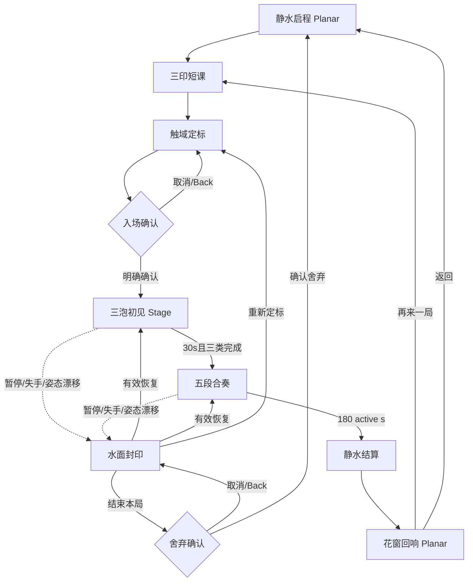

# 交互与空间设计规格 · BubbleReflexLab v3

> revision: 5 · roles: `task_decision_designer` + `interaction_xr_designer` + `spatial_composition_designer` + `spatial_design_system_designer` · Stages5–6 + Stage9–11 · sources: PM3 + UXR2 + Visual1 + Critique6

## 1. Design principles

| ID | assertion | scope | basis | implementation checkpoint | precedence |
|---|---|---|---|---|---|
| P01 | Every eligible actor must be readable as action verb + silhouette before it reaches hand range; color is never the only channel. | interaction/visual | PM O01/O03; UXR B1–B3/F02 | actor semantics; tutorial test | below P00 safety, above decoration |
| P02 | Correct stillness is an action: gray success closes only when untouched actor clears the interaction band, never through body displacement. | product/domain | PM R10; UXR F03 | verdict table and gray lifecycle | above score excitement |
| P03 | Difficulty may add simultaneous decisions and spacing variation but may not raise the gentle speed ceiling or demand locomotion. | motion/safety | PM O05; UXR differentiation | six recipe table | safety above novelty |
| P04 | A freeze is atomic across clock, spawn, transforms, collision/judgment and theme boundary; partial freeze is invalid. | state/data trust | PM O07; UXR FreezeSeal | state invariants/tests | safety above continuity |
| P05 | One input lease owns judgment at a time; a source change is visible and cannot produce duplicate or retroactive verdicts. | interaction/data trust | PM O08; UXR InputLease | arbitration states | correctness above responsiveness |
| P06 | Shared-space setup precedes explicit Full-Space entry; every immersive state has system-back and visible safe exit. | container/navigation | E07/E08; PM O10 | container/state graph | user control above immediacy |
| P07 | Results reveal completeness and persistence truth before celebrating score. | data trust | PM O09; UXR BestMark | result states | truth above reward |
| P08 | Theme/music boundaries orient time but never command tempo; semantic actor channels remain stable across all themes. | visual/audio/motion | PM O06; UXR differentiation | segment/layer contract | semantics above variety |

Conflict arbitration: P00 is the non-negotiable PM safety contract. Then P04/P05 correctness, P06 user control, P01/P02 rule legibility, P03 comfort, P07 trust, P08 atmosphere. A decorative or flow-efficiency benefit never overrides a higher row.

Negative list: no rear or face-near spawn; no below-floor source; no lanes, rails, walls or pose cutouts; no forced dodge/crouch/turn; no speed/BPM escalation; no color-only category; no auto Stage entry; no multiple input owners; no score claim from incomplete ledger; no actor movement during freeze; no persistent toolbar/tabbar by default.

## 2. Task / Decision Model

Decision-time values are qualitative because UXR2 records no measured timing baseline; later usability tests must measure them rather than treating labels as performance facts.

| Task | Actor/context | input evidence | decision output | error consequence | frequency | dependencies | duration scale |
|---|---|---|---|---|---|---|---|
| Q01 DecodeTriad | user at entry/tutorial | Chinese verb, silhouette, material, cue; PM O01 | remembered mapping for all three categories | wrong response category | entry + tutorial 3 times | none | reading / then one-glance |
| Q02 SetReachEnvelope | user before Stage | posture choice, head/hand pose, reach confirmation; A05 | accepted calibration revision | fatigue or unreachable band | once, plus recalibration | Q01 | deliberate seconds; measure |
| Q03 AdmitArrivalSeed | system before actor acquire | azimuth/elevation/radius, calibration rev, recipe; PM O02 | eligible or rejected seed | unsafe visible spawn | every spawn | Q02,Q08 | frame/event |
| Q04 TrackApproach | user during Stage | actor silhouette/verb, depth, band proximity | act now / wait / refrain | early/missed response | continuous per actor | Q03 | one-glance; measure |
| Q05 CommitSlap | user/system ordinary actor | hand/controller lease, contact speed/profile, actor kind | ordinary correct/error/no-decision | unfair or duplicate score | ordinary arrival | Q04,Q10 | event |
| Q06 CommitHold | user/system gold actor | grip closure, overlap/hold evidence, lease | gold correct/error/no-decision | false grab or miss | gold arrival | Q04,Q10 | event |
| Q07 CloseQuietPass | system gray actor | no contact + crossed band + valid lease interval | gray avoided/error | turns inhibition into dodge or premature award | gray arrival | Q04,Q10 | crossing event |
| Q08 AdvanceRecipe | system at six boundaries | elapsed active time, recipe index, actor load | segment0 tutorial or recipe1–5 active | pressure spike / wrong count | 6 segment starts | Q02,Q11 | boundary event |
| Q09 SwapAtmosphere | system at same boundary | recipe index, theme/audio readiness | atomic visual/audio layer id | timing drift/distraction | every 30 active seconds | Q08 | boundary event |
| Q10 LeaseInput | system/user | hand confidence/loss, controller activity, last terminal event | hand/controller/none owner | double judgment/unfair miss | input changes/frame | Q02 | immediate event |
| Q11 SealWorld | user/system on pause/loss | reason, clock, actors, spawn queue, judgments, layer boundary | valid FreezeSeal | hidden motion/time loss | pause/loss | Q08–Q10 | immediate |
| Q12 RestoreOrReframe | user after freeze | seal validity, recovered input, calibration revision | resume/recalibrate/exit | corrupt continuation | each pause | Q11 | deliberate choice |
| Q13 ReturnActor | system after terminal/out-of-bounds/invalid | lifecycle owner, reason, collider state | exactly-once pool return | ghost collisions/leak/reuse corruption | every actor | Q03,Q05–Q07 | event |
| Q14 ReconcileRun | system at 180 active seconds | immutable verdict ledger, eligibility counts | complete/partial tally, accuracy, badge, score | misleading award | once/run | Q05–Q09,Q13 | settlement |
| Q15 PersistBestAndExit | user/system result | tally completeness, current/best, write result, exit intent | saved/not saved; replay/home/safe close | false persistence or trapped exit | once/run + back | Q14 | reading + deliberate high-risk exit |

### 2.1 Dependencies and exclusivity

- Serial spine: Q01 → Q02 → Q03/Q08 → Q04 → exactly one of Q05/Q06/Q07 → Q13 → Q14 → Q15.
- Q08 and Q09 are boundary-coupled but atomically commit separate recipe and atmosphere facts.
- Q10 runs concurrently but grants exactly one lease; Q05–Q07 cannot commit with lease=`none`.
- Q11 interrupts Q03–Q10 as a barrier. Q12 alone can release or replace the seal.
- Q05/Q06/Q07 are mutually exclusive terminal decision families for one actor.
- Q14 waits until spawn closes and all eligible actor ownership is reconciled or explicitly partial.

### 2.2 Key human decisions

1. Choose posture and accept/retry the reach envelope.
2. For each actor: slap, hold, or intentionally do nothing based on category and band arrival.
3. During freeze: resume, recalibrate, switch/confirm fallback, or exit.
4. At result: replay, return home, retry save if offered, or close.

## 3. Competitive coverage audit

| adjacent category task | decision |
|---|---|
| readable incoming target and immediate feedback (Beat Saber) | included at need level in Q01/Q04/Q05–Q07; directional cuts and speed modifiers omitted by P03 |
| catch/rails/obstacles and musical flow (Synth Riders) | predictable depth approach and layer boundary included Q04/Q09; rails/choreography/obstacle dodge deliberately omitted |
| punch/dodge/pose walls (OhShape) | shape redundancy included Q01; large walls, body pose and dodge deliberately omitted; Q07 reframes inhibition as stillness |
| common scoring/progression | Q08/Q14 included; leaderboard/multiplayer/song selection omitted because prompt defines one solo fixed run |

## 4. Spatial Value Justification

| Task | spatial judgment | rationale | 2D counterfactual | benchmark relation | rating / Stage necessity |
|---|---|---|---|---|---|
| Q01 DecodeTriad | scale/symbol/time; no depth need at entry | rule learning is semantic, so a Planar window is clearer; Stage only demonstrates one-at-a-time arrival during tutorial | three illustrated buttons/cards teach rules adequately | absorbs early readability B1/B3, not their layouts | Medium; Stage=no at entry, yes only when combined with Q04 tutorial |
| Q02 SetReachEnvelope | body/position/distance/direction | user must judge whether a 3D hand band and forward source extent are physically comfortable from actual viewpoint | sliders and 2D diagram can collect numbers but cannot prove situated reach | competitor body use B1–B3 adds burden; this turns body into calibration | High; Stage=yes |
| Q03 AdmitArrivalSeed | direction/elevation/radius/simulation | invariant exists in the user's egocentric coordinate frame; visible proof must show front-only volume | 2D unit tests can validate math and should supplement, not replace spatial inspection | differentiates from tracks/walls via calibrated fan | High; Stage=yes for visual behavior, 2D sufficient for logic tests |
| Q04 TrackApproach | depth/distance/motion/time/body | deciding when actor enters natural hand band depends on binocular/egocentric approach | flat animation can test timing concept but not hand-relative depth | absorbs predictable approach B1/B2 without rails/lanes | High; Stage=yes |
| Q05 CommitSlap | hand position/contact/motion/simulation | direct palm-to-actor contact supplies embodied action and immediate causal feedback | controller/button or screen tap can exercise state logic, but loses spatial slap | absorbs direct action, rejects directional saber cuts | High; Stage=yes; controller fallback still spatial target |
| Q06 CommitHold | hand pose/overlap/duration | enclosing and briefly holding a 3D actor distinguishes grab from hit | press-and-hold UI can simulate logic but not hand enclosure | adjacent catch mechanic reframed as deliberate hold | High; Stage=yes |
| Q07 CloseQuietPass | position/time/no-contact/body stillness | untouched actor crossing a visible hand band makes intentional non-action legible without a dodge | timer/card can say “do not click,” sufficient for logic but weaker bodily inhibition | explicitly rejects OhShape dodge/wall burden | High; Stage=yes for experiential value |
| Q08 AdvanceRecipe | time/count/spacing; indirect spatial effect | recipe choice is logic; spatial value appears in the resulting actor distribution, not a floating selector | deterministic 2D timeline fully handles selection | absorbs progression need, avoids speed modifiers | Medium; Stage=no for decision, yes for consequences |
| Q09 SwapAtmosphere | time/environment/simulation | spatial ambient layer can make a calm temporal boundary perceptible around the field | window theme/audio swap is adequate for rule validation | absorbs music layering B2, rejects tempo command | Medium; Stage=yes only during play; no extra container |
| Q10 LeaseInput | body/input state; no inherent depth | arbitration is a trust/state problem; only target interaction tests require Stage | 2D source toggle and event log fully model ownership | competitor input mappings do not prove PICO fallback | Low for spatialization; Stage=no for control, context remains Stage |
| Q11 SealWorld | time/motion/simulation | seeing every actor and cue become still together is stronger proof of safety than a pause icon | 2D state snapshot can validate invariant and must back automated tests | differentiation opportunity: recovery over flow pressure | High; Stage=yes for visible freeze |
| Q12 RestoreOrReframe | body/position + planar decision | recalibration reuses situated Stage; resume/exit choices are readable planar overlay decisions inside current host | ordinary modal can decide path; cannot re-establish world-space reach | avoids fitness-game forced continuation | Medium; Stage=yes only for recalibration |
| Q13 ReturnActor | simulation/position; system-owned | out-of-bounds disappearance and collider removal occur in spatial lifecycle, but user need not see pool mechanics | 2D lifecycle tests fully prove ownership/return | not competitor-derived | Medium; Stage=yes for actor behavior, 2D essential for correctness |
| Q14 ReconcileRun | data/time; no depth need | statistics and badge require reading/comparison, which should not be spatialized gratuitously | Planar result is superior | avoids leaderboards/walls absent from brief | Low; Stage=no |
| Q15 PersistBestAndExit | data trust/navigation; no depth need | save status, replay/home and confirmation favor stable Planar reading and system back | ordinary app UI fully sufficient | deliberately omits multiplayer/store patterns | Low; Stage=no |

Spatial conclusion: Stage is justified for Q02–Q07, the visible consequences of Q08–Q09, Q11, recalibration in Q12 and actor behavior in Q13. Q01 entry, Q08 control, Q10 arbitration UI, Q14 and Q15 must remain planar or inline; adding 3D UI would be pseudo-spatiality.

## 5. Design Hypotheses

| Hypothesis | information model | spatialization | container strategy | user path | primary interaction | risk / engineering cost |
|---|---|---|---|---|---|---|
| A · 静水花窗 | one calm “aperture” shows the complete forward source envelope; actors converge into one horizontal hand band; only current verb is foregrounded | high but bounded to front 80°; egocentric depth and body reach; environment stays static | one Shared Planar setup/result window + explicit Full-Space Stage; no attachment by default | learn three seals → tune aperture → one-at-a-time tutorial → five mixture recipes → settle | direct slap/hold/stillness at a single band; one input lease | moderate: fan sampling, convergence paths, pool/judgment/freeze; lowest comfort risk |
| B · 掌心微缩台 | miniature three-dimensional tabletop inside a Volumetric WindowContainer; bubbles move within clipped diorama | medium; depth exists but target interaction is scaled/indirect | Shared Space Volumetric window only; Stage omitted except optional showcase | choose rules → manipulate tabletop scale → play entirely in bounded volume → result side panel | pinch/ray select miniature targets; controller pointer fallback | lower world-safety risk but higher precision/occlusion; contradicts requested Stage experience and weakens slap/grab embodiment |
| C · 三瓣环庭 | three semantic sectors distributed across a 150° arc around the user; each action has its own spatial sector | very high; direction encodes category and multiple bands surround user | Full-Space Stage first after a minimal consent sheet; sector cues and pause objects remain spatial | consent → sector calibration → category-specific spatial rounds → combined orbit → result in Stage | turn toward sector, bilateral actions, quiet sector for gray | high: head turning, peripheral targets, broader reach, more occlusion; threatens no-dodge/no-surprise contract |
| D · 单点灯塔 | only one centered actor ever exists; category and timing vary but spatial distribution is minimal | low; central depth approach only | Shared Planar entry + small Progressive Stage; no concurrent actors | rule → central tutorial → five speed/interval variants → result | single central slap/hold/no-action | easy and accessible but five tiers lack combination depth; temptation to use speed violates P03 |

These hypotheses differ in information topology (aperture/tabletop/sectors/single point), spatial degree, container, path, input and cost—not visual skins.

## 6. Concept Selection

Scores use 1–5 and are evidence-based comparisons, not quality-gate scores.

| hypothesis | task efficiency | spatial value | PICO comfort | domain depth | safety | accessibility | engineering feasibility | distinctiveness | total /40 | verdict |
|---|---:|---:|---:|---:|---:|---:|---:|---:|---:|---|
| A 静水花窗 | 5 | 5 | 5 | 5 | 5 | 4 | 4 | 5 | 38 | selected |
| B 掌心微缩台 | 3 | 3 | 5 | 3 | 4 | 3 | 3 | 4 | 28 | rejected |
| C 三瓣环庭 | 3 | 5 | 2 | 4 | 2 | 2 | 2 | 5 | 25 | rejected |
| D 单点灯塔 | 5 | 2 | 5 | 2 | 5 | 5 | 5 | 3 | 32 | rejected |

### 6.1 Score evidence

- A keeps all decisions in one hand band (Q04–Q07), calibrates the exact source envelope (Q02/Q03), preserves mixture depth (Q08), and respects P03/P04. Engineering cost is moderate, not trivial.
- B fits Shared Space well but fails the user-requested embodied Stage task: miniature ray/pinch makes slap and grab semantic approximations and increases fine-target burden.
- C has strong direction value but broad 150° distribution and turning conflict with front-only calm safety, accessibility and surprise constraints.
- D is comfortable and feasible but cannot express combinations meaningfully without changing speed/interval pressure; domain depth and spatial necessity are weak.

### 6.2 Selected concept: 静水花窗 / Stillwater Aperture

A user-aligned forward “aperture” defines the only legal source field. Bubbles drift through its calm depth and converge toward one calibrated hand-height band; the interface emphasizes one current verb, and untouched gray passage is celebrated as stillness. The aperture is not a portal/tunnel/track: it is a sparse safety boundary with no camera movement, lanes or environmental travel.

### 6.3 Market differentiation

- **Positioning**：a three-minute calm spatial inhibition game, not a rhythm-fitness track. Its distinctive promise is “read, wait, respond at hand height” with recovery and stillness as first-class outcomes.
- **Rationale**：UXR2 E01/B1–B3 show adjacent products use incoming readability, music, rails/walls and whole-body movement. UXR2 §3.2 identifies a quiet calibrated arrival field, stillness judgment, recipe-not-speed growth and explicit recovery. A fulfills all four while keeping PICO Stage only where Q02–Q07/Q11 prove direction/distance/body value.
- **EvidenceRefs**：UXR2 E01/E03/E07/E08/E11/E13; B1/B2/B3; §3.1 absorb/avoid; §3.2 opportunities; PM3 §8.8 originality contract.
- **Boundary**：the concept does not reuse competitor lanes, notes/rails, wall silhouettes, navigation, components, neon style or state order. Shape redundancy is an opportunity-level accessibility requirement only.

### 6.4 Rejected alternatives

- B rejected because Volumetric clipping and miniature pointing weaken the direct hand actions and Stage requirement; its lower physical risk does not compensate for reduced task value.
- C rejected because category-by-direction causes head turning and wider reach, conflicting with explicit front-only/no-surprise/no-large-movement constraints.
- D rejected because it removes combination decisions and would likely rely on speed escalation, opposing the five recipe and gentle-pressure contract.

## 7. Stage6 completeness self-check

All 15 tasks independently declare spatial dimensions, rationale, 2D counterfactual, benchmark relationship, rating and Stage necessity. Four materially distinct hypotheses are compared across eight required dimensions; selection, differentiation evidence, absorption boundary and three rejection rationales are complete. Architecture and visual direction remain undecided until their ordered stages.

## 8. Experience and container architecture

### 8.1 Experience layers

| semantic layer | responsibility | host | entry | exit | fallback |
|---|---|---|---|---|---|
| `静水前室` | start, three-rule learning, posture choice, calibration, explicit Stage consent, result, save truth | `WC-StillwaterDesk`, Planar WindowContainer in Shared Space | app launch or Stage close | user starts calibrated run, closes app, or replays | gaze+pinch/controller remain available; Stage never opens before confirmation |
| `花窗场` | situated calibration preview, one-of-each tutorial, five recipes, judgment, atomic freeze | `ST-StillwaterField`, Stage in Full Space | `T04 user.confirmStageEntry` after calibration | pause exit, settlement, system back, or safety recovery closes Stage | hand loss offers controller lease; failed recovery returns to the Planar desk without false result |

No separate Glance/HUD layer is created. Time, segment and input state are small inline facts within the Stage because a floating auxiliary window would add attention cost without a separate task. Immersion value is limited to Q02–Q07/Q11; Q01/Q10/Q14/Q15 stay planar.

### 8.2 Container selection

| ID | type / form | space state | tasks | boundary / visibility | entry value and stable exit |
|---|---|---|---|---|---|
| `WC-StillwaterDesk` | WindowContainer / Planar; depth fixed 640dp | Shared Space | Q01,Q02 setup,Q10 source choice,Q12 path choice,Q14,Q15 | only primary window visible by default; clipped planar content; Dynamic worldScale | launch host; explicit `开始校准`; system back exits directly only when no run is at risk |
| `ST-StillwaterField` | Stage / Mixed immersion=0 design intent | Full Space | Q02 situated preview,Q03–Q09,Q11,Q12 recalibration,Q13 | boundless Stage, but content is constrained to calibrated forward aperture | hand-relative depth/safety; explicit `进入花窗场`; system back or `结束本局` closes Stage and returns to Planar |

Legality: Shared Space contains only the Planar window. Opening the Stage switches to Full Space; closing it returns to Shared Space. Mixed preserves the real-environment view while the app is exclusive. The design needs head pose plus hand or controller input; exact permission/API support is downstream verification. No plane detection or spatial anchor is required.

### 8.3 Stage safety geometry

Coordinates are user-relative at accepted `calRev`: origin under the user, +Z accepted forward, +Y up, +X right. A seed must satisfy both the accepted envelope and current-head frontal eligibility before visibility.

| geometry | design range / rule | safety purpose |
|---|---|---|
| source azimuth | `−40°…+40°`; also within the current head frontal 80° at admission | never rear or peripheral surprise |
| source elevation | `−10°…+22°`; never above calibrated eye-near exclusion plane | excludes below-floor and near-overhead sources |
| source radius | `2.2…3.2m`; invalid seed recycled before visible | slow readable approach; not face-near |
| interaction band anchor | nominal user-local `(0, calibrated chest-to-shoulder midpoint, 0.62m)`; y/z derive from confirmation | fixed seated/standing hand range |
| band dimensions | nominal `1.10m W × 0.36m H × 0.35m D`, bounded by accepted bilateral reach | no large lateral/vertical reach |
| actor path | monotonic gentle convergence seed→band→clearance; no camera motion or sudden acceleration | predictable timing |
| head/posture drift | stop seeds and open FreezeSeal when pose no longer intersects accepted envelope; never silently move band | prevents rearward arrivals; offers recalibration |

These are design starting ranges, not device-validated ergonomics. Deterministic seed tests and seated/standing device calibration must validate or narrow them downstream.

## 9. Window attachment decision matrix

| need | placement mode | selected type | host | semantic role | persistence | frequency | rationale | rejected alternatives and rationale | validation plan |
|---|---|---|---|---|---|---|---|---|---|
| start/rule/calibration/result navigation | in-window | `InlineControl` | WC-StillwaterDesk | action local to current step | state-local | low | controls sit beside their content | TabBar rejects false parallel pages; Toolbar rejects navigation misuse; None removes required actions | focus order and ≥56dp targets in all tiers; device input later |
| first-use three-rule teaching | none | `None` | WC-StillwaterDesk | primary semantic state, not attachment | tutorial only | once/run | required learning is primary content | Coachmark trivializes it; InlineControl applies only to each acknowledgement; other attachments add no value | comprehension and preview state |
| pause/recovery choices | none (Stage-owned) | `None` | ST-StillwaterField | Stage-owned focus surface for resume/recalibrate/input/exit | temporary modal behavior | exceptional | no Window attachment host is needed; C7 is explicit Stage geometry over the frozen field | Sheet/Dialog would imply a Window host; InlineControl insufficiently focused; Toolbar unjustified | field freeze, safe first focus, back behavior |
| discard active run / exit | none (Stage-owned) | `None` | ST-StillwaterField | nested C7 confirmation variant | temporary | rare | consequence-specific Cancel-default focus stays in the same Stage surface | Dialog/Sheet attachment rejected without Window host; InlineControl cannot trap focus; unconfirmed None rejected | Escape/system back chooses Cancel; explicit destructive confirmation |
| Stage time/segment/input status | none | `None` | ST-StillwaterField | inline status facts | play duration | continuous | facts belong beside aperture, not an auxiliary workspace | Augment lacks a Window host; Toolbar is persistent chrome; InlineControl applies only to Pause | single focus/no obstruction |
| result detail | in-window | `InlineControl` | WC-StillwaterDesk | category detail/save retry near summary | result only | once/run | local settlement data | Subwindow is disproportionate; SpatialPopup is not persistent truth; None hides required detail | resize and save-failure tests |

No content is duplicated across TabBar, Toolbar or in-window navigation; neither TabBar nor Toolbar exists. C3 is the only Window Dialog; C7 is a Stage-owned focus surface, not a Window attachment. No Subwindow, SpatialPopup, Augment or auxiliary window is authorized.

## 10. Window sizing derivation

| methodology field | WC-StillwaterDesk decision |
|---|---|
| content / form / unit | familiar 2D reading, calibration and results → Planar dp; depth fixed 640dp |
| scene tier / baseline | productivity/main-content; official baseline starts at 1280×720dp; legal 320×180…2700×1800dp |
| viewing conditions | seated/standing, default about 1.75m, short setup/result around a 3-minute Stage run, `worldScale=Dynamic` |
| topology / density | one title/focus, one content, one local action region; one primary window; low-to-medium density |
| clear-FOV design target | primary ≤58°H×36°V within 65°×40°; secondary ≤75°H×48°V within 85°×55°; pending device measurement |
| floors | targets ≥56×56dp; project body ≥16sp and never below official 12dp; Chinese body line ≤40 chars |
| overhead | system TitleBar 96dp budgeted; no TabBar/Toolbar/Subwindow/Augment; contentInsets 32dp horizontal/24dp vertical |
| occlusion/motion | one window, so multi-window gap N/A; no app-driven large panel translation; default stays out of peripheral limit |

| candidate / tier | overall W×H dp | content area after TitleBar + insets | capacity / trade-off | verdict |
|---|---:|---:|---|---|
| Constrained minimum | `760×640` | `696×496` | one column; vertical seals; scroll detail; four 56dp actions preserved | selected min |
| Compact | `960×720` | `896×576` | calibration stacks; result ledger below summary | supported intermediate |
| Large default | `1200×800` | `1136×656` | three seals in row; 7:5 calibration/result columns | selected default, calibrated from baseline |
| Large maximum | `1480×920` | `1416×776` | more negative space; content width capped; larger risks occlusion | selected max |

Selected: default `1200×800dp`, min `760×640dp`, max `1480×920dp`, fixed Planar depth `640dp`, bounded variable aspect ratio, `ContentSize` semantics.

Reflow: Large (`W≥1200`) uses three seals in a row and 7:5 columns; Compact (`900≤W<1200`) stacks preview over controls and ledger below summary; Constrained (`760≤W<900`) uses one column, an in-safe-area fixed-bottom primary action and internal scrolling above it. Text/targets never scale as a whole. Height shortfall never clips Cancel/Back. Web asserts exact tier content areas; runtime/device later verifies worldScale, FOV, posture and TitleBar overhead.

## 11. State graph

| state | main task | decision output | primary focus | container | layout | semantic components | data dependencies | entry | exit / continue | exception recovery | return strategy |
|---|---|---|---|---|---|---|---|---|---|---|---|
| `N0 静水启程` | Q01,Q15 | start or safe close | three-rule promise + Start | WC-StillwaterDesk | title, triad strip, one CTA | C1 RuleSealDeck | saved best read | launch | T01→N1 | best read failure shows unknown, not zero | system back closes; no run at risk |
| `N1 三印短课` | Q01 | all mappings acknowledged | one seal then recall | WC-StillwaterDesk | hero seal, cue, progress | C1 RuleSealDeck | lesson index/ack | T01 | T02→N2 | unavailable hand shows controller option | back→N0 |
| `N2 触域定标` | Q02 | accepted calRev/posture | reach envelope confirm | WC-StillwaterDesk | preview above posture/retry/confirm | C2 ReachApertureCalibrator | posture, pose, calRev, input lease | T02/T07 | T03→N3 | invalid pose offers retry/controller/conservative envelope | back→N1 |
| `N3 入场确认` | Q02,Q15 | Stage consent/cancel | `进入花窗场` consequence | WC-StillwaterDesk | summary + Cancel default + Confirm | C3 StageConsentDialog | calRev/input | T03 | T04→N4; cancel→N2 | open failure→N2 with error | back/cancel→N2 |
| `N4 三泡初见` | Q03–Q07 | three tutorial verdicts | one actor + current verb | ST-StillwaterField | aperture, band, actor, sparse status | C4 ApertureField; C5 BubbleActor; C6 RunPulse | recipe0, clock,pool,actor,lease,calRev | T04 | T08→N5 after exact triad | loss/drift/pause→N6; invalid seed invisible recycle | system back→N6 |
| `N5 五段合奏` | Q03–Q10,Q13 | recipe1–5 ledger | nearest eligible actor | ST-StillwaterField | aperture, bounded actor load, status | C4 ApertureField; C5 BubbleActor; C6 RunPulse | recipes,clock,pool,ledger,layers | T08 | T09→N8 at 180 active s | loss/drift/pause→N6; OOB→return | system back→N6 |
| `N6 水面封印` | Q11,Q12,Q15 | resume/recalibrate/input/exit | FreezeSeal recovery surface | Stage + C7 world focus surface | frozen field behind four actions | C7 FreezeRecoverySurface; C5 BubbleActor(frozen) | snapshot,reason,calRev,lease | T05/T10/T11 | T06→prior; T07→N2; T12→N7 | invalid seal forbids resume | back stays paused; explicit valid resume |
| `N7 舍弃确认` | Q15 | keep/discard | Cancel-default confirmation | C7 nested Stage surface over N6 | consequence + Cancel + Discard | C7 FreezeRecoverySurface(exit-confirm variant) | active run/seal | T12 | T13→N6; T14→N0 | action failure stays paused | back/Escape→N6 |
| `N8 静水结算` | Q14 | complete/partial tally | completeness before reward | ST-StillwaterField | no new actor; settle text | C6 RunPulse(settling); C8 ResultBloom(pending) | spawn closed,ownership,ledger | T09 | T15→N9 | conflict marks partial; no badge/save | back waits or safe partial return |
| `N9 花窗回响` | Q14,Q15 | replay/home/save retry | accuracy/categories/best truth | WC-StillwaterDesk | summary, ledger, save, actions | C8 ResultBloom | tally,badge,score,best,write | T15 | replay→N1; home→N0 | write failure preserves current result, offers retry | back→N0 |

### 11.1 Transitions

| ID | from | to | trigger event | executed action | explicit confirmation |
|---|---|---|---|---|---|
| T01 | N0 | N1 | `user.beginPressed` | `beginLesson()` | no |
| T02 | N1 | N2 | `lesson.triadAcknowledged` | `openCalibration()` | no |
| T03 | N2 | N3 | `calibration.accepted` | `sealCalibration(calRev);openStageConsent()` | yes |
| T04 | N3 | N4 | `user.confirmStageEntry` | `openStageMixed();activateRecipe(0);startActiveClock()` | yes |
| T05 | N4/N5 | N6 | `user.pausePressed` | `captureFreezeSeal(manual)` | no |
| T06 | N6 | prior N4/N5 | `user.resumePressed && seal.valid && lease.valid` | `restoreFreezeSeal();resumeActiveClock()` | yes |
| T07 | N6 | N2 | `user.recalibratePressed` | `closeStage();preserveRunPaused();openCalibration()` | yes |
| T08 | N4 | N5 | `clock.activeElapsed==30s && tutorial.exactTriadComplete` | `commitBoundary(recipe1,theme1,audio1)` | no |
| T09 | N5 | N8 | `clock.activeElapsed==180s` | `closeSpawns();freezeActors();reconcileLedger()` | no |
| T10 | N4/N5 | N6 | `input.lossSustained` | `captureFreezeSeal(inputLoss);revokeLease()` | no |
| T11 | N4/N5 | N6 | `pose.outsideAcceptedEnvelope` | `captureFreezeSeal(poseDrift);stopSeedAdmission()` | no |
| T12 | N6 | N7 | `user.exitRunPressed` | `openDiscardDialog()` | yes |
| T13 | N7 | N6 | `user.cancelDiscard OR system.back OR key.escape` | `closeDiscardDialog();keepFreezeSeal()` | no |
| T14 | N7 | N0 | `user.confirmDiscard` | `returnAllActors();closeStage();discardIncompleteRun()` | yes |
| T15 | N8 | N9 | `settlement.closed OR settlement.partialDeclared` | `closeStage();renderTruthfulResult();attemptBestWriteIfEligible()` | no |
| T16 | N9 | N1 | `user.replayPressed` | `clearRunLedger();beginLesson()` | no |
| T17 | N9 | N0 | `user.homePressed OR system.back` | `retainResultHistory();showHome()` | no |
| T18 | N9 | N9 | `user.retrySavePressed` | `retryBestWrite();renderWriteOutcome()` | yes |

Stage entry and active-run discard require explicit confirmation. N3/N7 first-focus Cancel; system back/Escape maps to Cancel. No transition awards gray before clearance, resumes an invalid seal, or claims saved best without write success.

## 12. End-to-end flow

Happy path is N0→N1→N2→N3→N4→N5→N8→N9. Journey mapping: entry/rule=N0–N1, setup=N2–N3, learn=N4, flow=N5, recovery=N6–N7, understand/return=N8–N9. Every Full-Space path closes Stage before Shared Space.

## 13. Composition synthesis

Layout IDs are project-local derivation labels, not template or case identifiers.

| layout / states | derivation evidence | single primary focus | regions and ownership | density ceiling | responsive / spatial transformation | rejected option |
|---|---|---|---|---|---|---|
| `L-A ThresholdSeals` / N0,N1 | Q01 precedes every task; three mappings share one semantic set; Start/ack is highest-frequency action here | current rule seal or Start, never both emphasized | P0 title/status; P1 C1 rule field; P2 C1 local action; P3 best-read caption | max 3 seals + 1 primary + 1 secondary line; no metric wall | Large three seals row; Compact 2+1; Constrained one hero seal with step paging and fixed-bottom primary | card dashboard rejected: splits one memory chunk into competing panels |
| `L-B ReachFrame` / N2 | posture→pose evidence→accept/retry is serial; live reach visualization must stay adjacent to the decision | accepted aperture preview | P0 step title; P1 C2 spatial preview; P2 C2 posture/input controls; P3 C2 confirm/retry | one aperture preview, two posture choices, max three actions, one status | Large 7:5 preview/control columns; Compact/Constrained preview above controls; action stays fixed-bottom in Constrained | settings form grid rejected: hides situated calibration outcome among fields |
| `L-C ConsentFocus` / N3 | Stage entry is a single high-consequence decision using calRev and input status | Cancel-default choice pair | modal heading; consequence copy; accepted calibration summary; C3 Cancel/Enter actions | ≤6 text lines, two actions, one status icon | same centered modal; Constrained width minus 32dp margins; actions stack Cancel then Enter | full-page consent rejected: loses visible return context; popup rejected: insufficient focus |
| `L-D AperturePlay` / N4,N5 | Q03–Q07 share the same actor lifecycle; high-frequency actor decision must dominate; status only supports timing/recovery | nearest eligible C5 actor | S0 C4 source contour; S1 C4 interaction band; S2 pooled C5 actors; S3 C6 top-center pulse; S4 C6 pause at lower-right within front 50° | tutorial max 1 active actor; recipes cap visible load by recipe facts; only one verb cue per eligible actor; ≤2 status lines | world geometry stays fixed to calRev; variants change actor count/spacing, not layout; no planar tier scaling | lanes/tunnel rejected: imply velocity/choreography and copy competitor topology; surrounding HUD rejected |
| `L-E FrozenWaterline` / N6,N7 | Q11 is an atomic barrier; recovery choices depend on one snapshot; background actors must remain visible as proof but not interactive | C7 safe recovery action, default Resume when valid or Recalibrate when invalid | F0 frozen L-D behind scrim; F1 reason/seal summary; F2 input state; F3 four actions; F4 nested exit-confirm within C7 | one reason, one seal status, four actions; nested confirm shows only two actions | C7 world surface stays within safe central 50°; no repositioning of frozen actors; nested confirmation stacks actions when constrained | replacing scene with blank pause page rejected: prevents visual verification of atomic freeze |
| `L-F QuietSettlement` / N8 | Q14 must reconcile before celebration; no user action competes with completeness truth | C6 settlement status | same aperture/band, actors cleared/frozen; central settlement line; secondary reconciliation count | one progress/status phrase + one exception line | stationary world; no responsive panel; partial branch changes copy/shape only | instant badge burst rejected: can celebrate incomplete data |
| `L-G EchoBloom` / N9 | summary derives from one ledger; category totals explain accuracy; save truth precedes replay/home decision | C8 accuracy+badge truth block | R0 accuracy/badge; R1 category ledger; R2 score/best/write status; R3 replay/home/retry actions | one headline metric, 3 category rows, 2 scores, ≤3 actions | Large 7:5 summary/ledger; Compact ledger below; Constrained single scroll column with actions fixed-bottom | leaderboard/dashboard rejected: no social data and would overstate a single calm run |

### 13.1 Placement geometry

Planar coordinates use the `1200×800dp` overall default with a `1136×656dp` content area after TitleBar and insets. `x/y` are content-local from top-left. Stage coordinates are user-local meters at `calRev`; all Stage surfaces face the user with yaw toward the accepted head-forward axis and zero roll.

| layout layer / region | anchor | x / y | w / h | z / orientation | owner |
|---|---|---|---|---|---|
| L-A P0 title | top-center | 0 / 0 | 1136 / 80dp | planar z=0 | C1 |
| L-A P1 rule field | center | 0 / 96 | 1136 / 344dp | planar z=0 | C1 |
| L-A P2 action | bottom-center | 344 / 528 | 448 / 72dp | planar z=4dp focus elevation | C1 |
| L-B P1 preview | top-left | 0 / 80 | 640 / 456dp | planar z=0; embedded diagram depth ≤640dp | C2 |
| L-B P2 controls | top-right | 664 / 80 | 472 / 456dp | planar z=4dp for active control | C2 |
| L-C modal | center | 238 / 120 | 660 / 416dp | planar z=24dp above retained N2 | C3 |
| L-D S0 source contour | head-forward center | az `−40°…+40°`, elev `−10°…+22°` | radial `2.2…3.2m` | faces user; no roll | C4 |
| L-D S1 band | chest/shoulder center | x `−0.55…+0.55m`; y midpoint±0.18m | z `0.445…0.795m` | plane normal toward user | C4 |
| L-D S2 actor volume | admitted seed→band→clearance | within S0/S1 bounds | ordinary/gold/gray diameter `0.16…0.24m` | billboard cue faces head; physical actor orientation may rotate ≤8° | C5 |
| L-D S3 pulse | head-forward upper center | az 0°, elev +18° | angular box ≤22°W×8°H; nominal z 1.25m | faces user | C6 |
| L-D S4 pause | lower-right front | az +22°, elev −14° | angular target ≥6° and logical fallback ≥56dp | faces user | C6 |
| L-E Sheet | head-forward center | az 0°, elev 0° | angular ≤46°W×34°H; nominal z 1.05m | faces user; actors remain behind at fixed transforms | C7 |
| L-G R0 summary | top-left | 0 / 0 | 640 / 416dp | planar z=0 | C8 |
| L-G R1 ledger | top-right | 664 / 0 | 472 / 416dp | planar z=0 | C8 |
| L-G R3 actions | bottom | 0 / 512 | 1136 / 88dp | planar z=4dp | C8 |

### 13.2 Composition invariants

- `primaryFocusCount=1` in every state. A modal disables background focus and input.
- All Planar gaps use 16/24/32dp scale candidates that Stage11 must tokenize; no target falls below 56dp.
- Stage content remains within the front 80° source envelope; controls remain within central 50° and never require turning.
- Theme layers change ambience only; component positions, actor semantic shapes and the band do not move at a boundary.
- Reduce Motion removes decorative breathing/trails and uses crossfade, but never hides trajectory, clearance or freeze truth.

## 14. Eye-hand and controller interaction contract

| context / action | hand path | controller fallback | ownership / judgment | feedback and recovery |
|---|---|---|---|---|
| Planar focus/activate | gaze focus + pinch | ray focus + primary button | UI focus owner only; no gameplay verdict | 120ms outline/shape emphasis; disabled stays readable |
| ordinary slap | palm/contact motion through eligible C5 ordinary actor inside band | point at eligible actor + primary action button | current `InputLease.owner` commits `ordinary_slap` once | faceted ring collapses, `拍破` cue, 20–35ms optional haptic; wrong kind commits category error once |
| gold hold | enclosing pinch/grab maintained across actor overlap; no large arm sweep | point/overlap + grip hold | lease commits `gold_hold` only after valid overlap+hold evidence | double-loop closes, `抓住` cue; early release returns pending until actor clears |
| gray stillness | no user gesture | no button/grip | system commits `gray_clear` only when untouched actor clears band | dashed halo opens and `已避开` appears; no dodge prompt |
| Pause | gaze+pinch Pause | menu/secondary button mapped to Pause | captures FreezeSeal before showing C7 | all transforms/clock/spawn/judgment/layers freeze atomically |
| calibration | gaze+pinch posture/retry/confirm; comfortable bilateral reach sample | ray+button selects posture and conservative controller envelope | writes new calRev only on Confirm | invalid sample keeps prior rev and gives specific retry copy |

`InputLease` has exactly one owner: `hand | controller | none`. Controller activity never steals a hand-owned lease mid-verdict; source switching is offered only when no actor judgment is pending or while frozen. A terminal actor rejects later input regardless of source.

Transient hand-loss design threshold: loss `<350ms` keeps the lease but suspends new commits and never records a miss; recovery restores continuity if the actor is still eligible. Loss `≥350ms` revokes the lease and triggers T10 FreezeSeal. This is a tunable design assumption requiring downstream tracking/device validation, not an SDK fact.

### 14.1 Focus, back and confirmation

- All Planar/Sheet/Dialog actions support gaze+pinch and controller ray+button. Focus outline is 3dp plus shape/text, never color-only.
- System back: N0 closes; N1→N0; N2→N1; N3 cancels→N2; N4/N5 opens N6; N6 stays paused; N7 cancels→N6; N8 safely declares partial only when reconciliation cannot close; N9→N0.
- `Escape` in Web preview mirrors system back. N3/N7 focus Cancel first; destructive/Stage-enter actions cannot be activated by back.
- No drag/zoom is required for core tasks. Window move/resize remains system-owned; there is no gameplay manipulation that can move the interaction band.

## 15. Fixed recipe and layer contract

Actor speed is constant within post-tutorial recipes: design target `0.30m/s`, allowed path-smoothing variance `±0.03m/s`, never recipe-scaled; downstream device tuning may lower it but may not exceed `0.36m/s` without re-review. Tutorial uses `0.22m/s`. Counts are eligible appearances; invalid seeds do not consume a count.

| segment / active time | eligible count | max simultaneous eligible | required composition | min band-arrival separation | ambient theme / audio layer | pressure guard |
|---|---:|---:|---|---:|---|---|
| S0 `0–30s` tutorial | exactly 3 | 1 | ordinary→gold→gray exactly once each, with cue | `≥5.0s` | 雾青 / `water_0` | one decision only; 0.22m/s |
| S1 `30–60s` recipe1 | 4 | 1 | all types, ordinary repeated | `≥3.8s` | 杏光 / `water_1` | no overlap |
| S2 `60–90s` recipe2 | 5 | 2 | one ordinary+gray overlap; all types | `≥3.2s` or opposite lateral spacing ≥0.42m | 薄荷 / `water_2` | gray overlap never blocks action reach |
| S3 `90–120s` recipe3 | 6 | 2 | one gold+gray and one ordinary+ordinary pair | `≥2.9s` or lateral spacing ≥0.46m | 淡紫 / `water_3` | no two grab decisions together |
| S4 `120–150s` recipe4 | 7 | 2 | two mixed pairs; at least two gray | `≥2.7s` or lateral spacing ≥0.48m | 珊瑚 / `water_4` | same 0.30m/s; no body dodge |
| S5 `150–180s` recipe5 | 8 | 2 | three mixed pairs; every type ≥2 | `≥2.6s` or lateral spacing ≥0.50m | 夜蓝 / `water_5` | nearest eligible remains singular focus |

Boundary commit is atomic across recipe/theme/audio IDs after active clock reaches each 30s boundary. Crossfade never alters actor speed, collider, judgment timing, semantic shape, label, or band pose.

## 16. Motion and accessibility specification

| motion | trigger / purpose | duration / easing | amplitude / speed | Reduce Motion | performance fallback |
|---|---|---|---|---|---|
| Planar→Stage | T04 orient without surprise | 520ms, `(0,0,0.2,1)` | opacity 0→1; scale 0.98→1, no camera translation | 260ms opacity only | immediate stable placement + 180ms fade |
| Stage→Planar | T14/T15 stable exit | 360ms, `(0.4,0,0.2,1)` | opacity only | 180ms opacity | immediate switch after safe actor return |
| aperture breath | idle safety-boundary legibility | 4000ms loop, sine ease | stroke opacity ±0.08; no position change | static 0.72 opacity | static contour |
| actor approach | seed admitted | path-defined; constant 0.22 tutorial / 0.30m/s recipes | monotonic seed→band, no acceleration spike | trajectory unchanged; trail removed | simplified interpolation and no trail |
| band eligible | actor enters band | 180ms ease-out | stroke +2dp/0.01m; no band movement | instant stroke/text change | text+shape only |
| verdict | terminal judgment | 240ms `(0,0,0.2,1)` | actor scale 1→0.86 and opacity 1→0; no burst beyond 0.08m | 160ms opacity + result label | label only then recycle |
| theme/audio boundary | each 30 active s | 800ms visual / 1200ms audio linear crossfade | ambience opacity only; audio gain crossfade | same crossfade, no movement | immediate color token swap only after actor-safe frame |
| freeze | T05/T10/T11 | ≤100ms semantic snap | actor transforms exactly unchanged; status opacity 1 | same | same; correctness outranks animation |
| Sheet/Dialog | N6/N7 | 240ms ease-out | 12dp-equivalent rise, no world displacement | 140ms fade | immediate with focus set |
| focus/press | gaze/pinch | 120/90ms ease-out | scale max 1.03 / press 0.98 | stroke/opacity only | stroke/text only |

Global accessibility: `reduceMotion=enabled`, `controllerFallback=enabled`, `colorIndependentSemantics=enabled`, `textScaling=enabled` within reflow limits, `stableExit=enabled`. No camera movement, flicker, forced head turn, haptic-only meaning or audio-only timing exists. Text scaling at 130% causes rewrap/internal scroll rather than clipping or smaller targets.

## 17. Interaction minimum-completeness self-check

| check | evidence | verdict |
|---|---|---|
| principles/tasks/spatial concept | §§1–7, Stage7 independent pass | pass |
| container/attachments/sizing | §§8–10, legal Shared↔Full path, None/Inline comparisons, 3 candidates and reflow | pass |
| states/transitions/flow | §§11–12, N0–N9 and T01–T18 with recovery/back/confirmation | pass |
| composition | §13 all states mapped to seven derived layouts and exact geometry | pass |
| input/controller/back | §14 single lease, transient loss, confirmation and stable back | pass |
| recipe/motion/accessibility | §§15–16 fixed gentle recipes, atomic layers, RM/performance fallbacks | pass |

`minimumCompletenessGate=pass` for Interaction5; device validation remains `not_performed`.
